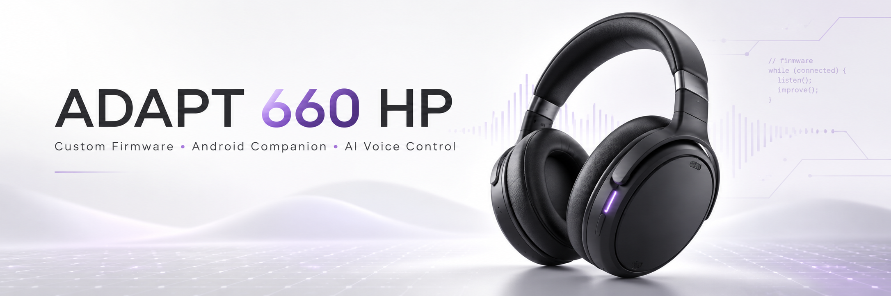
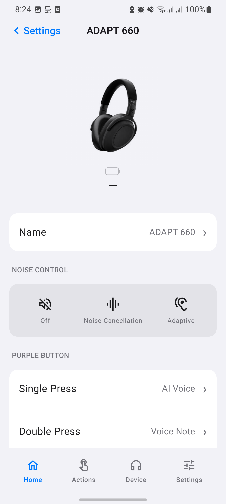
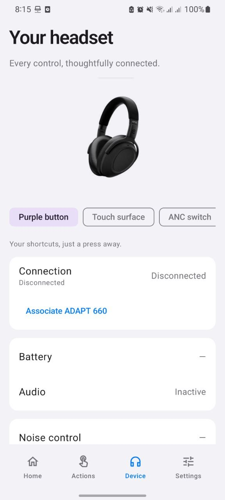
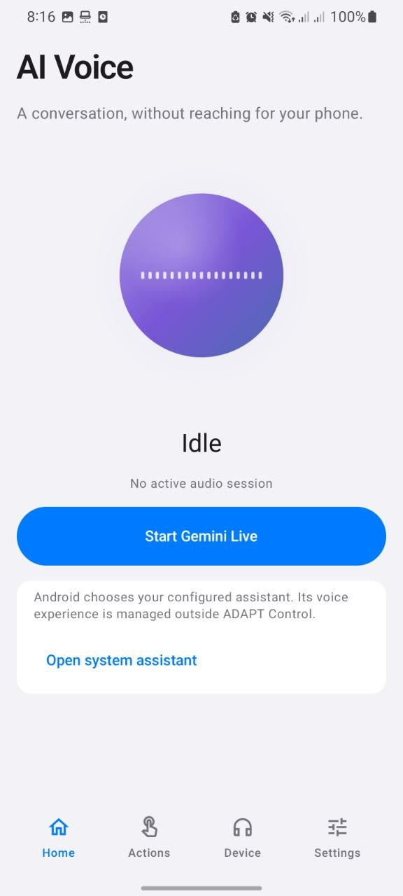
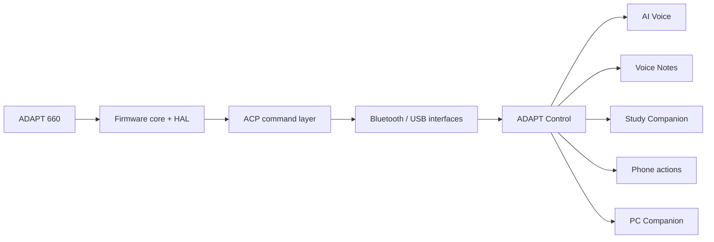

**Voice. Ideas. Focus. One button.**

**ADAPT 660 HP** brings a programmable firmware control engine and a native Android experience to the **EPOS / Sennheiser ADAPT 660**. **ADAPT Control** connects headset actions with AI voice, instant voice notes, guided study and everyday phone and PC shortcuts.

## Built around your day

**Keep the headset on. Keep your workflow moving.** A useful thought should be easy to capture. A question should lead straight into a conversation. A study session should fit into the time you have.

ADAPT Control puts these experiences around one familiar physical control: **the purple button**. Configurable gestures, a clear command protocol and a unified application turn that button into a personal shortcut to your next action.

**The purpose is control:** bring firmware behavior, voice experiences and automation into one coherent system, with an interface that is as considered as the hardware it serves.

## Meet ADAPT Control

**A focused interface built around your headset.** Product photography, compact settings groups, segmented noise controls and clear navigation keep the important controls close. Choose **Light**, **Dark** or **System** appearance.

<table>
  <tr><th>Home</th><th>Device</th><th>AI Voice</th></tr>
  <tr>
    <td></td>
    <td></td>
    <td></td>
  </tr>
</table>

## One button. Your actions.

| Gesture | Default experience |
| --- | --- |
| **Short press** | **AI Voice** — start a conversation. |
| **Double press** | **Instant Voice Note** — capture the thought. |
| **Long press** | **Study Companion** — make progress out loud. |
| **Protected very-long press** | **Pairing / Recovery** — keep a dedicated recovery path. |

**Make it yours.** Change the everyday mappings and tune press timing to your preference. Assign AI, phone, PC or combined actions. The protected pairing / recovery gesture remains separate from normal action mappings.

## Voice, notes and learning

### AI Voice

**A direct path from a question to a conversation.** The voice interface brings session status, an audio-responsive orb, transcripts and start, stop and reconnect controls into one screen.

- **Integrated Gemini Live** uses Google's Firebase AI Logic client for realtime voice sessions.
- **System Assistant** opens the assistant configured on Android.
- **Provider architecture** separates the voice experience from the AI service through `VoiceAssistantProvider`.
- **Session audio management** coordinates headset microphone and speaker routing, audio focus, interruptions and headset disconnects.
- **PCM audio pipeline** records mono 16-bit audio at 16 kHz and plays Gemini audio at 24 kHz.

### Instant Voice Notes

**Catch an idea before it slips away.** Record a note, refine its transcript and keep it organized on your phone.

- **Local WAV recording** with silence detection, manual stop and bounded recording duration.
- **Save or discard**, with playback and transcript editing.
- **On-device transcription integration** and typed-note entry.
- **Categories, tags and project labels** for useful organization.
- **Searchable note history** stored in private application files.

### Study Companion

**Turn spare moments into focused practice.** Choose a topic and learning mode, then work through spoken explanations and questions.

| Mode | Experience |
| --- | --- |
| **Explain** | Learn a concept and ask follow-up questions. |
| **Quiz** | Work through one question at a time with answer feedback. |
| **Rapid Fire** | Practice with short, focused questions. |
| **Exam** | Complete a question sequence before reviewing explanations. |
| **Review Weak Topics** | Revisit concepts highlighted in previous sessions. |

**Structured feedback** records questions, answer quality, practice scores, mistakes and weak topics. **Local session history** keeps transcripts and progress together. `CourseSource` provides a dedicated course-content integration boundary.

## Headset and application controls

| Area | Controls |
| --- | --- |
| **Home** | Headset photo, battery indicator, Name row, noise control, press mappings, hands-free mode, everyday companions and recent activity. |
| **Actions** | Short, double and long press assignments; AI, phone, PC and combined actions; protected recovery. |
| **Device** | Purple button, touch surface, ANC switch, Bluetooth, USB and audio-jack sections; companion association; connection, battery, audio and firmware information. |
| **Settings** | Gesture timing, voice provider, audio preferences, default study topic and mode, PC pairing and appearance. |
| **Hands-free mode** | Foreground service readiness with an accessible Stop notification and audio capture limited to requested sessions. |
| **Diagnostics** | Expandable engineering controls, event information and sanitized log export. |

## The firmware engine

**ADAPT firmware is a portable C++17 control core built around explicit state, configurable policy and a replaceable hardware abstraction layer.** It keeps gesture recognition, connection behavior, recovery, configuration and command processing in one coordinated engine.

| Firmware component | Responsibilities |
| --- | --- |
| **Button state machine** | Debounce, short / double / long press recognition, configurable timing and protected recovery. |
| **Connection lifecycle** | Off, boot, pairable, connecting, connected, music, call, analog, USB, recovery and error states. |
| **Recovery policy** | Responsiveness monitoring, connection timeouts, bounded retries and a dedicated manual recovery path. |
| **Persistent configuration** | Versioned settings records, integrity checks, generation tracking, mapping updates and timing-combination validation. |
| **Standard control interface** | Typed media, volume, call, microphone, ANC / ambient, multipoint and touch operations through capability-gated adapters. |
| **Feedback engine** | Original tone patterns and bounded LED / feedback signals. |
| **Diagnostics** | Retained ring log, state observations, lifecycle events and ping. |
| **Hardware abstraction layer** | Independent clock, button, transport, settings, radio, audio and standard-control interfaces. |
| **Host runtime** | Firmware simulator, scripted device events, persistent configuration and authenticated command bridge. |

**Gesture defaults:** 650 ms short-press maximum, 400 ms double-press window, 1,500 ms long-press threshold, 5,000 ms protected-recovery threshold and 25 ms debounce. These values are configurable and checked as a complete timing configuration.

**Recovery defaults:** 2,000 ms responsiveness watchdog, 5,000 ms connection timeout and up to three recovery attempts. Wireless, analog and USB modes have explicit transitions; call activity takes priority over music activity.

**Configuration format:** schema 2, a 46-byte record and explicit serialization. Settings are checked before application, and rejected updates retain the prior configuration.

The HAL separates platform integration from control policy, allowing firmware components to evolve without coupling the Android interface to board-specific details. See the [firmware architecture](docs/firmware/architecture.md), [configuration](docs/firmware/configuration.md) and [lifecycle](docs/firmware/lifecycle.md).

## The command layer

**ACP 0.1 is the shared language between firmware and ADAPT Control.** C/C++ and Kotlin codecs use bounded binary frames with version and type fields, sequence numbers, payload lengths and CRC integrity checks.

**Command families:** device state, button events, action mappings, settings, capabilities, standard controls, lifecycle, diagnostics, errors and ping.

**GATT frame assembly** handles ordered fragments, timeouts, characteristic separation and corrupt frames. **Transport interfaces** separate Bluetooth / USB integration from application actions. **The authenticated host bridge** exposes the same command system to Android development workflows.

**Control packets and session audio have separate paths.** See the [protocol specification](docs/protocol.md) and [control transport](docs/firmware/control-transport.md).



## Phone and PC automation

**Phone shortcuts:** play / pause, next track, open an application, open a URL, flashlight and timer. `ActionProvider` keeps execution separate from gesture mapping and interface state.

**PC Companion:** direct HTTPS communication with certificate pinning, an expiring single-use pairing code, bearer authentication, rate limiting and request deduplication.

**PC shortcuts:** play / pause, volume up / down, mute, open the configured application and lock the workstation. Actions use an explicit allowlist. Windows protects stored credentials with **DPAPI**; Android protects pairing credentials with **Keystore**.

**Focus / Both** combines a phone study action with a PC application action and presents the outcome of each step. See [PC setup and pairing](pc/README.md).

## Local by design

**Notes, study history and preferences stay with the application.** Private JSON and WAV files store the library; **DataStore** stores preferences; **Android Keystore** protects pairing credentials.

**No database service is required.** Firebase AI Logic supplies the Gemini client independently of database products. Requested live voice audio is sent to the selected AI provider; local notes and study history remain on the phone.

## Build and install

**Android:** Kotlin + Jetpack Compose, Android 10+, Android SDK 35 and JDK 17/21. Target device: **Samsung Galaxy S20+**.

```powershell
cd android
./gradlew.bat assembleDebug
adb install -r app/build/outputs/apk/debug/app-debug.apk
```

**ADAPT Control 0.3.0** · Application ID: `dev.adapt.control` · APK: `android/app/build/outputs/apk/debug/app-debug.apk`.

**Firmware host:** CMake 3.16+ and a C++17 compiler.

```powershell
cmake -S firmware -B build -G "MinGW Makefiles"
cmake --build build
build/adapt_sim.exe
```

For Visual Studio, omit the generator and add `--config Debug`. Linux/macOS use `build/adapt_sim`.

**PC Companion:** Python 3.12+ on Windows. Install [`pc/requirements.txt`](pc/requirements.txt), then follow the [companion guide](pc/README.md).

## Explore the platform

| Component | Location |
| --- | --- |
| **Firmware core, HAL and host runtime** | [`firmware/`](firmware/) |
| **Native Android application** | [`android/`](android/) |
| **Secure Windows companion** | [`pc/`](pc/) |
| **Protocol and engineering documentation** | [`docs/`](docs/) |
| **Firmware, USB and Bluetooth tooling** | [`tools/`](tools/) |
| **Product images and screenshots** | [`assets/`](assets/) |

**Guides:** [Android setup](docs/android/SETUP.md) · [Application architecture](docs/android/architecture.md) · [Firmware architecture](docs/firmware/architecture.md) · [ACP protocol](docs/protocol.md) · [PC Companion](pc/README.md).
