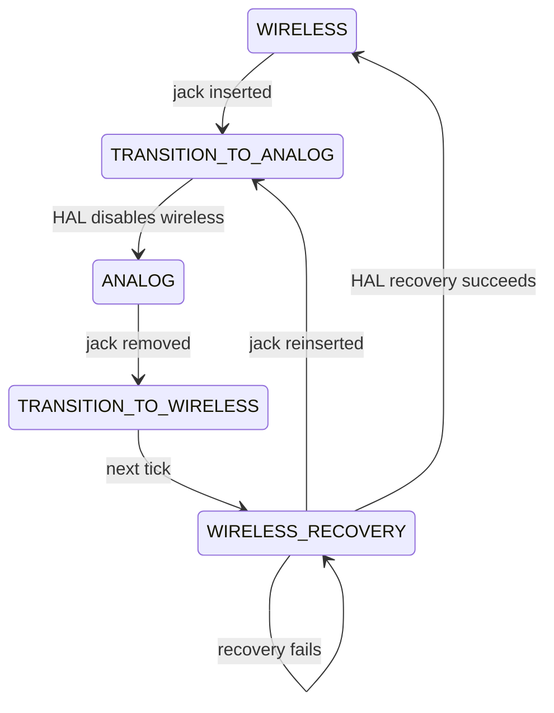

# Reverse-engineering notebook

## Analog-jack hypothesis

**CONFIRMED documented behavior:** analog insertion disables Bluetooth; removal
attempts reconnection to paired devices. [EPOS guide, printed page 10](https://shop.eposaudio.com/globalassets/__pim/products/adapt-600/adapt-660/3748334b-be64-4be8-b6d8-8dc815d4a328_51128_adapt66x_userguide_a07_1124_en_int_original.pdf).
**CONFIRMED user report:** analog cable use previously restored unusable Bluetooth.
**ASSUMED cause:** a wireless lifecycle reset may clear stale state. No diagnosis.

Transition states/logs exist for observation. HAL failure retains the transition;
rapid reinsertion cancels recovery. Recovered host wireless is disconnected, not
automatically connected. No reset register or power sequence is asserted.
To compare real behavior, record a normal jack insertion/removal with OS link/audio
states and timestamps; do not disturb an update. Production retry cadence must be
bounded/backed off; Phase 2 now implements three attempts with delayed retries,
followed by ERROR. See [custom lifecycle](lifecycle.md) for exact software defaults.

## Machine/package investigation (2026-10-04)

**CONFIRMED:** no ADAPT 660 present in Windows USB/HID/audio inventory. No installed
EPOS/Sennheiser application was found in standard Windows uninstall registry keys.
No top-level vendor directory was found in ProgramData, LocalAppData, RoamingAppData
or Program Files. A recursive filename search covered Downloads, Desktop,
ProgramData, LocalAppData, RoamingAppData and both Program Files roots, skipping
development dependency/build directories and links. Only a VS Code GitHub metadata
JSON bearing the repository name was returned; it is not a firmware package.
Search access errors were recorded (first 100 retained); this is not proof that
no package exists in inaccessible, skipped or other locations. Samsung app-thumbnail
metadata seen during an initial broad search is not firmware evidence.

Private evidence remains in ignored `research/package-search.json` and
`research/usb-phase1.json`. No vendor package was copied, downloaded, extracted or
flashed. No update, factory reset, pairing-list clearing or undocumented command
was performed. **UNKNOWN:** package version, manifest, images, signatures,
certificates, checksums, compression/encryption and firmware target architecture.

## Repeatable tool workflow

1. Run `python tools/firmware/find_packages.py` (optional explicit roots).
2. Verify provenance with EPOS Connect/support. Copy the original package to ignored
   `research/`; preserve it unchanged and record acquisition source/version.
3. `python tools/firmware/hash.py research/official.zip` records streaming SHA-256.
4. `python tools/firmware/analyze.py research/official.zip --output research/report.json`
   produces deterministic JSON/Markdown measurements and bounded recursive ZIP analysis.
5. Optional `--extract research/new-directory` validates paths/limits before writing.
6. Compare USB snapshots with `tools/usb/compare.py`; preserve private captures and
   annotate every finding as CONFIRMED, ASSUMED or UNKNOWN.

Tool validation used synthetic manifest + nested image, not an EPOS image.
Analyzer reports hashes, CRC/container fields, strings, entropy, archive/signature
matches and provisional architecture clues. Encryption/signature validity remain
UNKNOWN unless separate evidence establishes them. Non-ZIP embedded formats need
deeper [Binwalk](https://github.com/ReFirmLabs/binwalk) inspection; no extractor or
disassembler is silently run. See [tool limits](../../tools/firmware/README.md).
